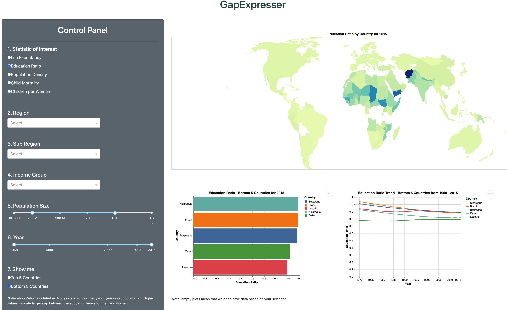

# GapExpresser

## Link to the dashboard

[GapExpresser](https://dsci532-gapexpresser.herokuapp.com/)

## What are we doing?

### The problem
- The [Education For All](https://www.wikiwand.com/en/Education_For_All) act is a global commitment to solve education disparity problem in some regions of the world. Many entities are working together to achieve the goal including many development aid agencies.
- However, these agencies are varied in size, missions, expertise, and experience. Some agencies operate with a very narrow scope, in location and/or directive, while others operate globally and in many development areas.  Large agencies often have the resources to hire dedicated research staff or employ experts in their chosen area of focus, but many agencies do not have these resources.   

### The solution
- We propose building a data visualization app to assist these organizations visually explore some key statistics for different countries/regions.  
- This will help them identify countries/regions that would benefit from the type of service the agency provides, or gain additional insight into a region where they already operate.  
- These data visualizations may also challenge some misconceptions about a particular region, which in turn can help these agencies better serve the communities they operate in.   
- Our app will provide these organizations a snapshot of several key development statistics. Users can explore these statistics by filtering by region and other demographic factors.

## Description of the dashboard Interface
The app has a single main page with three visualizations that depend on the filters selected. Most importantly, the top left contains a filter which selects the statistic of interest and this is the main filter on which all of the visuals are built and includes life expectancy, child mortality, education ratio, population density and CO2 emissions. At the top of the page is a global map which displays a color gradient corresponding to the level of the chosen statistic of interest for each country. A filter can be applied for region, sub region and income group and only the countries contained in those filters will be colored on the map. Furthermore, there is a also a slider which can control the minimum and maximum population size for these countries. These filters also apply to the two bottom plots. The bottom left chart is a horizontal bar chart showing the statistic of interest for the top 5 or bottom 5 countries (controlled via a button switch) in the filtered group to allow for a closer look at the data. The bottom right chart displays the statistic of interest over time in a line plot (top 5 or bottom 5) and also has an additional filter for the date range for users to see how the data in those specific countries trended over time.

## Dashboard Interface


## To help us improve the dashboard
1. Fork [the repository](https://github.com/UBC-MDS/532-Group21)
2. Install dependencies
```
pandas
gunicorn
altair
dash==1.18.1
dash_bootstrap_components
plotly==4.14.3
vega_datasets
```
3. To run the app locally, run the following command from the root of this repository   
   `python src/dashboard/app.py`
4. Create an issue thread to discuss with the team about the changes/improvements you propose to make. [Here](CONTRIBUTING.md) is the detailed contribution guid.


## **License**
[](https://github.com/UBC-MDS/532-Group21/blob/main/LICENSE)